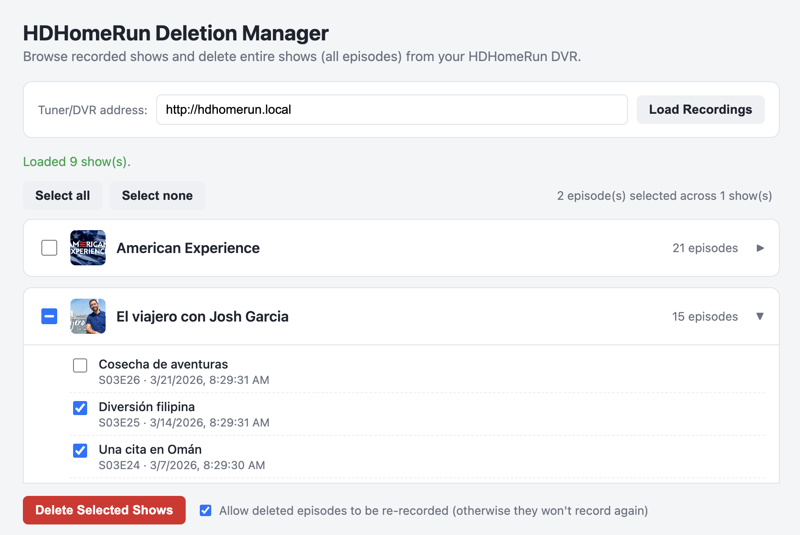
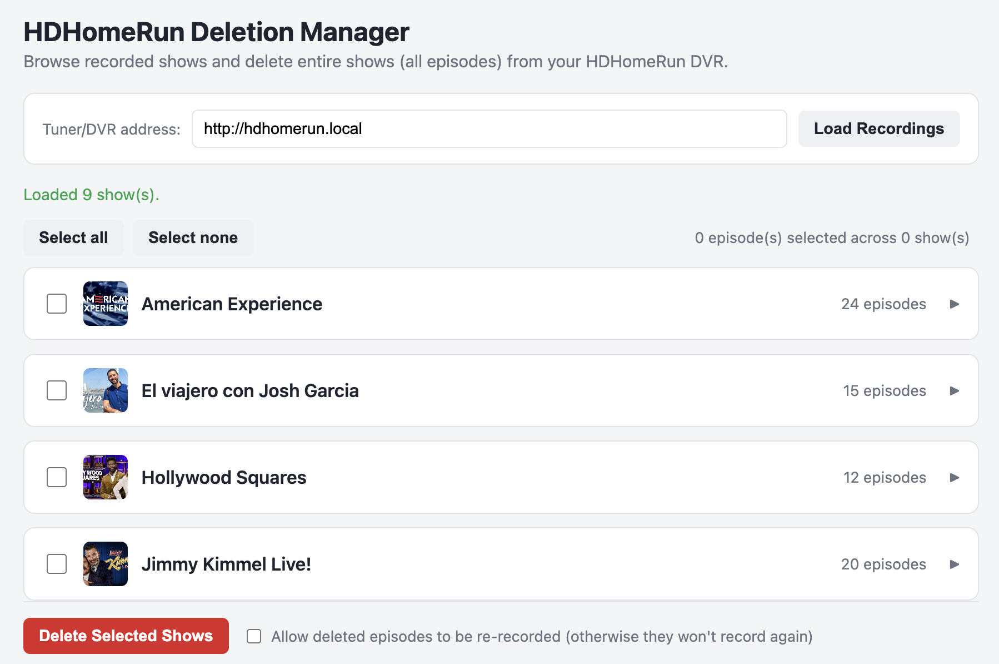

# HDHomeRun Deletion Manager

The [HDHomeRun software](https://www.silicondust.com/hdhomerun/) does not have a way to delete multiple files (yet). Instead, you have to manually delete each file which requires at least 2 mouse clicks and some painful scrolling. 

So, I vibe-coded this single page web application that uses Javascript in the web browser to offer a convenient deletion manager for your HDHomeRun box. 

## How To Use It

If you have your HDHomeRun box on your home network, and can go to the management link at [http://hdhomerun.local](http://hdhomerun.local), then you’re all ready to go. 

Just open the app in your web browser. The app is a single web page named hdhomerun-deletion-manager.html

It should work in any modern web browser that runs Javascript, and on any system (Linux, MacOS, Windows, Chrome, iOS, Android) but I have only tested it on MacOS.

If the app is unable to access your HDHomeRun recording box, it’s almost certainly because either:

- Your box is not accessible from your computer
- You need to set permissions on your web browser to allow web pages to access local devices on your network. In newer versions of MacOS, this setting is found in: 
`System Settings -> Privacy & Security -> Local Network`

